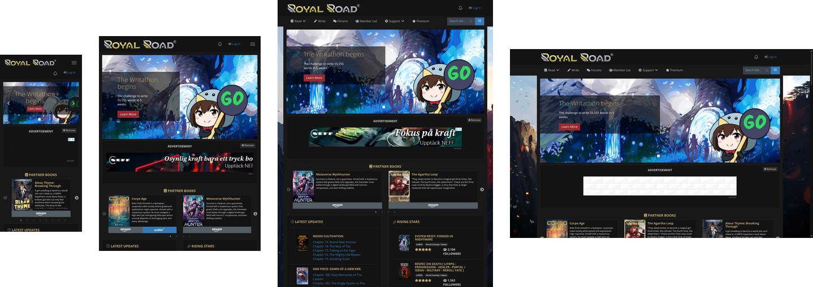
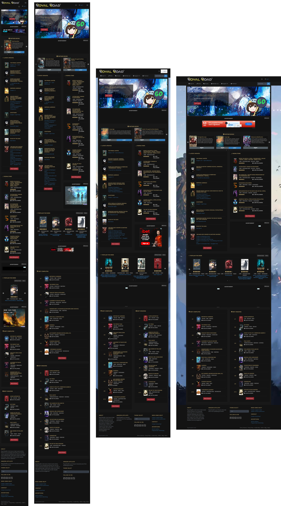
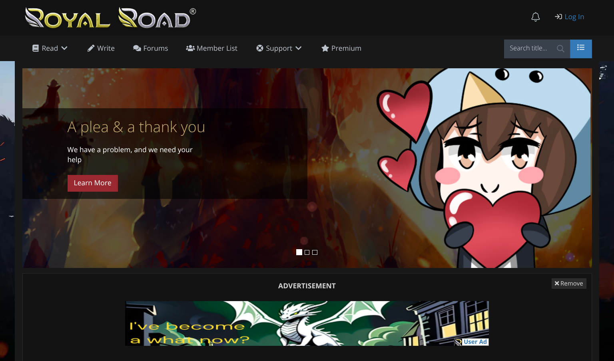
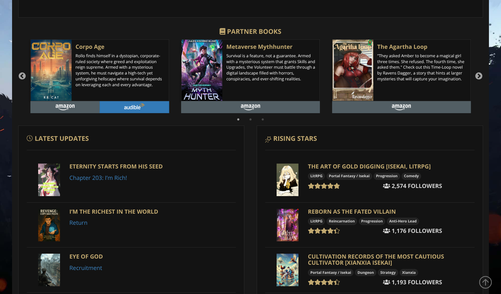
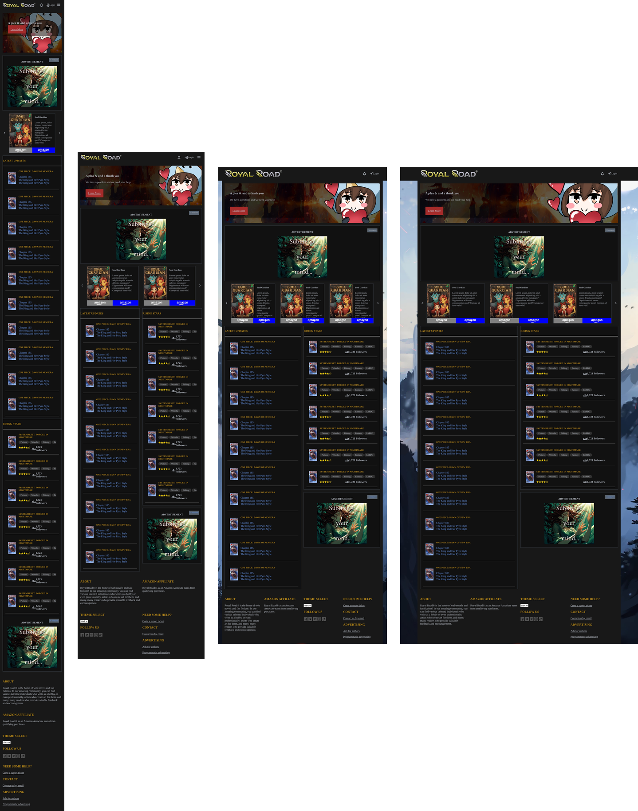

# NobleStreet
Skolprojekt i HTML/CSS klon av [RoyalRoad.com](https://royalroad.com) (längst ner på sidan kan man välja 'dark mode')

Detta är Daniel Gherghettas och Arvids inlämning

# Screenshots på orginalsidan

## Desktop layout

## Några komponenenter

## Tablet layout
.png>)
## Mobile layout 
.png>)

# Screenshots på vår klon

Avgränsnignar vi gjort är att inte ha med mer än fram till andra karusellen (fast ändå med footern då)

# Checklista

- [x] Din projektmapp innehåller minst en HTML fil och en CSS fil samten README.md
- [x] I README.md filen ska det tydligt framgå vilken sida du har valt att återskapa och eventuella avgränsningar du har alt att göra och varför, en länk till originalhemsidan samt ditt namn.
- [x] Git och Github har använts (repot ska vara publikt så jag kommer åt det)
- [x] Minst en skärmdump på orginalhemsidans utseende skall finns i er projektmapp
- [x] Elementen på sidan skall vara såpass responsiva att de stannar kvar i bild
- [x] Färger, storlekar och avstånd skall vara snarlika orignalhemsidans
- [!] Uppgiften skall vara inlämnad i tid! (projektmappen zippas ihop och lämnas in i läroplattformen som grupp)

## Krav för väl godkänt:
- [x] Kraven för godkänt är uppfyllda
- [x] Elementen på sidan skall vara fullt responsiva - alltså matcha orginalhemsidans (tror det)
- responsivitet
- [x] Det ska finnas flera skärmdumpar på orginalhemsidans utseende för olika
- skärmstorlekar - minst en för mobil, en för tablet, och en för desktop.
- [ ] Färger, storlekar och avstånd skall matcha orignalhemsidans
- [x] Ett ikonset (css fil från FontAwesome eller MaterialUI) ska laddas in i head taggen,
- ikoner från filen skall sedan användas på minst ett ställe i html-koden.
- [x] Koden skall vara logiskt strukturerad med tydliga kommentarer för dess uppbyggnad

